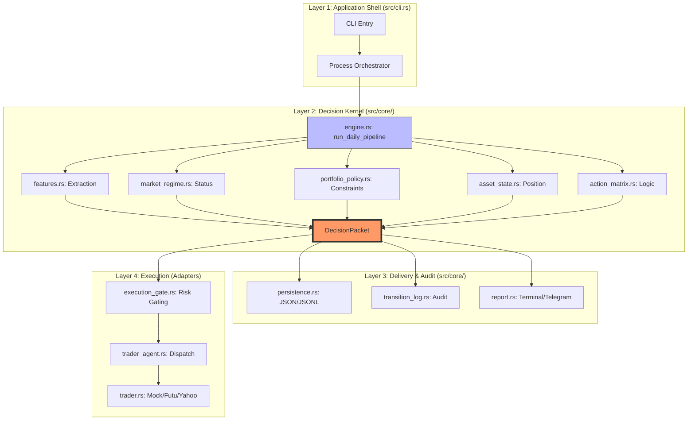
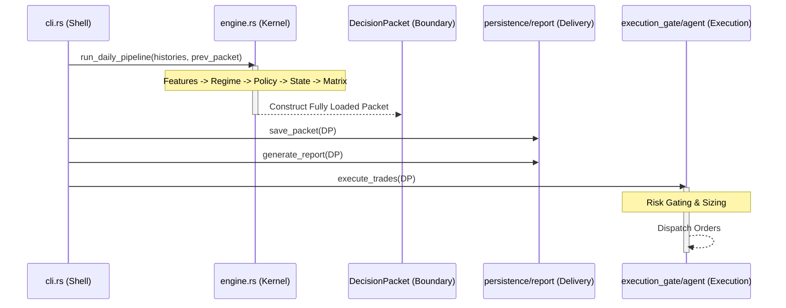

# Sentinel 2.0: Architecture Elevation Guide

本文档对 Sentinel 决策引擎的四层架构模式进行了深度定义。系统已从早期的“线性功能堆砌”演进为以 `DecisionPacket` 为核心事实源（Source of Truth）的模型驱动架构。

## 1. 领域边界图 (Domain Map)

## 2. 调用时序图 (Call Sequence)

## 3. 重构优先级清单 (Refactoring Priority)

### P0: 核心收口 (Kernel Tightening)
- [x] **engine.rs 纯粹化**：完全移除了 `run_daily_pipeline` 中的手工补全。
- [x] **market_regime.rs 语义闭环**：通过提前 `recalibrate` 消除了 `CONFIRMED` 状态判定的 1 天滞后，实现了真正的 T+0 决策。

### P1: 配置与执行硬化 (Config & Execution Hardening)
- [x] **配置一致性**：恢复了 `weight` 及交易控制字段，确保核心特征计算与 `config.toml` 的生产权重完全对齐。
- [x] **实盘链路打通**：在 `cli.rs` 中完整接通了 `FutuTrader` 实盘执行器，告别了 Daemon 模式下的 Mock 依赖。

### P2: 增强交付 (Enhanced Delivery)
- [x] **稳定模板化**：基于 `DecisionPacket` 建立了结构化的渲染契约，`report.rs` 已成为纯粹的下游消费者。
- [x] **预算门禁修正**：修正了 `ExecutionGate` 的预算检查顺序，确保在 `AGGRESSIVE` 放大模式下依然严守 `max_daily_budget`。

### P3: 系统纯净化 (System Purification)
- [x] **零告警交付**：消除了全量编译告警（0 warnings），实现了从内核到适配器层的逻辑极致纯净。
