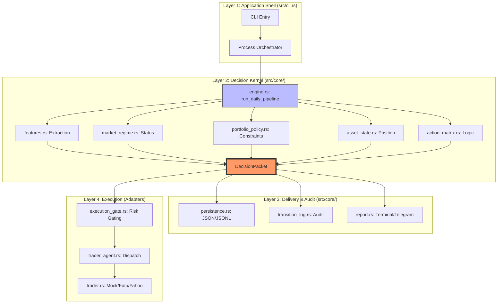
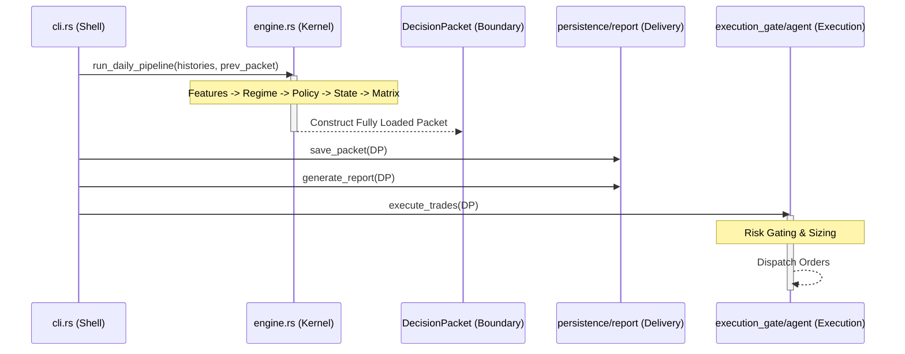

# Sentinel 2.0: アーキテクチャ昇格ガイド (Architecture Elevation Guide)

本ドキュメントでは、Sentinel 意思決定エンジンの4層アーキテクチャパターンを詳細に定義します。システムは初期の「線形な機能の積み上げ」から、`DecisionPacket` を唯一の真実のソース（Source of Truth）とするモデル駆動型アーキテクチャへと進化しました。

## 1. ドメイン境界図 (Domain Map)

## 2. 呼び出しシーケンス図 (Call Sequence)

## 3. 重構築優先度リスト (Refactoring Priority)

### P0: カーネルの締め付け (Kernel Tightening)
- [x] **engine.rs の純粋化**: `run_daily_pipeline` 内の手動による補完ロジックを完全に削除。
- [x] **market_regime.rs のセマンティック閉ループ**: `recalibrate` を前倒しすることで `CONFIRMED` 状態判定の1日の遅延を解消し、真の T+0 意思決定を実現。

### P1: 設定と執行の堅牢化 (Config & Execution Hardening)
- [x] **設定の一貫性**: `weight` および取引制御フィールドを復旧し、コア特徴の計算が `config.toml` の生産ウェイトと完全に整合することを保証。
- [x] **実盤リンクの開通**: `cli.rs` において `FutuTrader` 実盤執行器を完全に接続し、Daemon モードにおける Mock 依存から脱却。

### P2: デリバリーの強化 (Enhanced Delivery)
- [x] **安定したテンプレート化**: `DecisionPacket` に基づく構造化されたレンダリング契約を確立。`report.rs` は純粋な下流コンシューマーへ進化。
- [x] **予算ゲートの修正**: `ExecutionGate` の予算チェック順序を修正し、`AGGRESSIVE`（拡大）モード下でも `max_daily_budget` を厳守することを保証。

### P3: システムの純浄化 (System Purification)
- [x] **警告ゼロのデリバリー**: 全量コンパイル時の警告を排除（0 warnings）。カーネルからアダプター層に至るまで、ロジックの極限の純粋さを実現。
