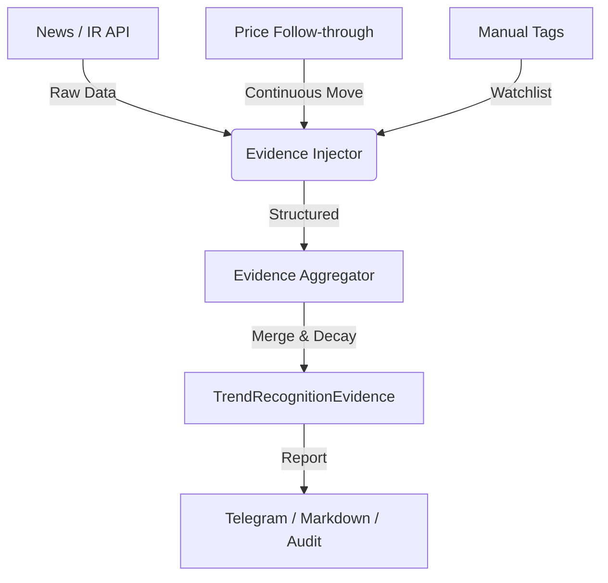

# Phase 5-B: 自動証拠収集および構造化（Automated Evidence Ingestion）

## 1. 目的

Phase 5-A で構築した「実体的な証拠層」の骨組みに対し、外部ソースからの自動データ取得機能を実装する。これにより、分析者の手動アノテーションへの依存を減らし、市場の重要なファンダメンタルズ変化をリアルタイムに近い速度でトレンド認識に反映させる。

## 2. ターゲットと非ターゲット

### ターゲット
- 外部 API（ニュース、決算速報等）からのシグナル抽出。
- 抽出されたシグナルの構造化（`AutomatedEvidenceRecord`）。
- Phase 5-A の手動タグ（`event_tags`）とのマージロジック。
- 価格アクションのフォロースルー（突破後の継続性）を「証拠」として自動カウントするロジック。

### 非ターゲット
- 高度な NLP（自然言語処理）エンジン自体の開発（外部 LLM API または単純なキーワードマッチングを使用）。
- 意思決定層（Gate/NO TRADE）への影響（非汚染原則を維持）。

## 3. アーキテクチャとデータ流



## 4. データ構造定義

### AutomatedEvidenceRecord
```rust
struct AutomatedEvidenceRecord {
    source: EvidenceSourceType,
    evidence_type: EvidenceType,
    confidence: f64,      // 0.0 ~ 1.0 (ソースの信頼性)
    description: String,  // 監査用
    timestamp: DateTime<Utc>,
}

enum EvidenceSourceType {
    Manual,        // 手動アノテーション
    OfficialIR,    // 決算速報・公式発表
    NewsMedia,     // 主要ニュースメディア
    PriceAction,   // 価格追随（フォロースルー）
}

enum EvidenceType {
    CapexPayoff,        // 投資回収の検証
    EarningsValidation, // 業績の裏付け
    OrderVisibility,    // 受注見通しの改善
    FollowThrough,      // 突破後の価格継続性
}
```

## 5. 実装タスク

### P0: 骨格の構築
- [ ] `AutomatedEvidenceRecord` 構造体の定義。
- [ ] `EvidenceAggregator` の実装（手動タグと自動シグナルの統合）。
- [ ] `event_days:N` の自動計算（イベント発生日からの経過日数）。

### P1: 外部インジェクターの試作
- [ ] 決算発表日（Earnings Date）の自動取得と `EarningsValidation` への変換。
- [ ] 価格フォロースルー（例：突破後 3 日間 5% 以上を維持）の自動証拠化。

### P2: 高度な構造化
- [ ] ニュース見出しからのキーワード抽出（"AI investment", "Record order" 等）による自動タグ付け。
- [ ] 証拠の永続化（`transition_log` への `AutomatedEvidenceRecord` の埋め込み）。

## 6. レポート表示の要件

- **ソースの明示**: 手動アノテーションか、自動収集（News/IR）かを明示する。
- **因果関係の監査**: なぜその `conviction_score` になったのか、根拠となった `description` を表示する。

## 7. 検証プラン

- **单元测试**: 複数のソースからの証拠が正しく重み付け・マージされることを確認。
- **Fixture テスト**: 過去の GOOG/NVDA の決算日データを入力し、期待通りの証拠が生成されるか検証。
- **統合テスト**: パイプライン全体を通じて `conviction_score` がレポートまで正しく伝播することを確認。

## 8. 制約事項

- **非汚染原則**: 自動収集された証拠がいかに強力であっても、`Decision Layer` の Gate（価格アクション）を強制的に開くことは禁止する。
- **静的解析優先**: 外部 API 障害時でも、システムはフォールバックして（手動タグのみ、あるいは価格アクションのみで）動作を継続しなければならない。
